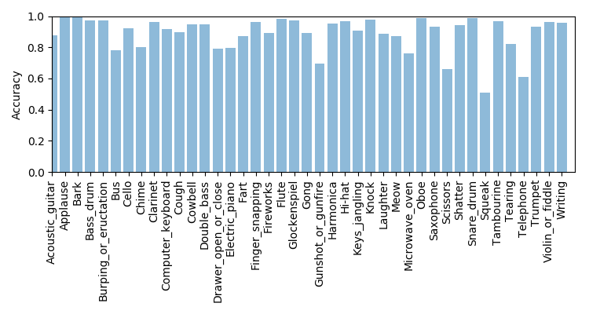

# DCASE 2018 Task 2 Audio Tagging of Freesound

DCASE 2018 Task 2 is a task to classifiy short audio clips to one of 41 audio classes such as 'fireworks', 'cello', 'barks' and so on. We provide a convolutional neural network (CNN) baseline system implemented with PyTorch in this code base. More details about this challenge can be found http://dcase.community/challenge2018/task-general-purpose-audio-tagging

## DATASET

The dataset is downloadable from http://dcase.community/challenge2018/task-acoustic-scene-classification. There are 41 audio classes. The duration of the audio samples ranges from 300ms to 30s. 

|                       | Training | Testing                         |
|:---------------------:|----------|---------------------------------|
|   Manually verified   | 3710     | ~1.6k                           |
| Not manually verified | 5763     | ~7.8k (Not used for evaluation) |
| Total                 | 9473     | ~9.4k                           |

## Run the code
**1. (Optional) Install dependent packages.** If you are using conda, simply run:

$ conda env create -f environment.yml

$ conda activate py3_dcase2018_task2

**2. Then simply run:**

$ ./runme.sh

Or run the commands in runme.sh line by line, including: 

(1) Modify the paths of data and your workspace

(2) Extract features

(3) Train model

(4) Evaluation

## Result

We apply a convolutional neural network on the log mel spectrogram feature to solve this task. Training takes around 50 ms / iteration on a GTX Titan X GPU. The model is trained for 3000 iterations. 

<pre>
root        : INFO     Loading data time: 6.799 s
root        : INFO     Calculating scalar time: 0.528 s
root        : INFO     Training audios number: 8653
root        : INFO     Validation audios number: 820
root        : INFO     Number of training patches: 27520
root        : INFO     train acc: 0.040, train mapk: 0.055
root        : INFO     valid acc: 0.029, validate mapk: 0.049
root        : INFO     ------------------------------------
root        : INFO     Iteration: 0, train time: 1.161 s, eval time: 1.489 s
root        : INFO     train acc: 0.540, train mapk: 0.623
root        : INFO     valid acc: 0.541, validate mapk: 0.626
root        : INFO     ------------------------------------
......
root        : INFO     ------------------------------------
root        : INFO     Iteration: 3000, train time: 6.082 s, eval time: 1.607 s
root        : INFO     train acc: 1.000, train mapk: 1.000
root        : INFO     valid acc: 0.859, validate mapk: 0.874
root        : INFO     ------------------------------------
root        : INFO     Iteration: 3100, train time: 5.162 s, eval time: 1.571 s
root        : INFO     train acc: 1.000, train mapk: 1.000
root        : INFO     valid acc: 0.863, validate mapk: 0.875
</pre>

### Overall accuracy

In development, we leave out 820 manually verified audios for evaluation. The overall performance looks like:

|       | accuracy | mAP@3 |
|:-----:|----------|-------|
| Total | 0.876    | 0.887 |

### Class-wise accuracy

The class-wise accuracy is shown as blow:

## Summary
This codebase provides a convolutional neural network (CNN) for DCASE 2018 challenge Task 2. Some sound classes such as 'applause', 'bark' have high classification accuracy. Some sound classes such as 'squeak', 'telephone' have low classification accuracy. 

### External link

The official baseline system implemented using Keras can be found in https://github.com/DCASE-REPO/dcase2018_baseline
